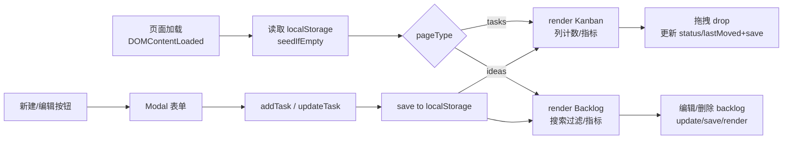

## 总体
- 单页静态站点（可多页面），无后端；使用 HTML/CSS/JS（可选 Tailwind/FontAwesome）。
- 两个页面：任务看板（index.html）、灵感池（ideas.html）。
- 数据保存在浏览器 localStorage，键名如 `opc-board-v1`。
- 所有新增/编辑在弹窗（modal）内完成，支持编辑/删除。

## 数据模型（Task/Idea）
```json
{
  "id": "string (uuid)",
  "title": "string",
  "desc": "string",
  "tags": ["string"],
  "priority": "P1|P2|P3",
  "type": "idea|feature|bug",
  "status": "backlog|todo|dev|done|publish",
  "dependency": "string (可为空，用于说明依赖哪个任务/链接)",
  "releaseTime": "string (可为空，发布时间/里程碑)",
  "risk": false,
  "createdAt": "ISO string",
  "updatedAt": "ISO string",
  "lastMoved": "YYYY-MM-DD"
}
```

## 页面 1：任务看板（index.html）
- 顶部导航：标题 + 跳转到灵感池链接 + “新建任务”按钮（type="button"，弹窗）。
- Hero/指标：进行中(todo+dev)、已完成(done)、灵感池(backlog)、待发布(publish)。
- Dashboard Summary：今日推进(done/publish 当日)、阻塞/风险(risk=true)、活跃任务(todo+dev)。
- 视图切换：流转看板 / 列表视图；列表视图左侧显示类型+标题+梗概，右侧显示状态/操作，仍可编辑删除。
- Kanban：四列 Todo/Dev/Done/Publish；卡片可拖拽跨列，更新 status/lastMoved，实时计数，卡片上可编辑/删除、转为灵感(backlog)、标记进行中/阻塞（右上角图标）。
- 列表视图：按行列出任务，含标签/优先级/Release，右侧状态+编辑/删除/转为灵感/标记。
- 弹窗（与 ideas 共用）：标题、描述、标签(逗号)、优先级(P1/2/3)、类型(idea/feature/bug)、状态(backlog/todo/dev/done/publish)、依赖(可选)、Release Time(可选)；保存/取消。

## 页面 2：灵感池（ideas.html）
- 顶部导航：标题 + 跳转任务看板 + “新建想法”按钮（type="button"）。
- Hero/指标：灵感总数(status=backlog)、进入开发(status=dev)。
- Backlog 列表：搜索框(标题/标签)，仅显示 backlog；卡片有编辑/删除（仅 backlog）。
- 卡片有“转为 Todo”按钮，可一键将 backlog 灵感状态改为 todo，并在任务页展示.
- 弹窗字段同上，可直接指定状态以分配.

## 交互细节
- Modal：新建按钮 -> 弹窗；编辑预填；取消/关闭清空编辑态.
- 编辑/删除：灵感池卡片上出现；删除后刷新列表与指标.
- 拖拽：仅任务页 Todo/Dev/Done/Publish 列；backlog 不可拖拽；dragstart/dragover/drop 更新并保存.
- 转换：
  - 灵感池卡片“转为 Todo”会将 backlog 项改为 todo，并出现在任务页.
  - 任务卡片“转为灵感”会将状态设为 backlog、type 设为 idea，并回到灵感池.
- 标记：任务卡片支持标记循环（空 → 进行中 → 阻塞 → 空），以小图标/按钮展示.
- 搜索：ideas 页实时过滤 backlog（标题或标签）。

## 指标刷新
- 任务页：todo/dev/done/publish 计数；backlog 计数；inprogress=todo+dev；active=inprogress；risk=risk 标记数；today=今日完成/发布数.
- 灵感页：ideaTotal=backlog 数；ideaDev=dev 数.

## 样式/主题
- 可选深色（#0f172a，玻璃拟态）或浅色主题；状态色：todo 粉、dev 青、done 绿、publish 黄.
- 按钮使用 `type="button"` 防止表单提交刷新.

## 脚本初始化
- 通过 `body.dataset.page` 区分 ideas/tasks。
- DOMContentLoaded：绑定 form submit、新建/关闭按钮、搜索；加载 localStorage（空则 seed demo）；render 更新列表、看板、指标。
- 主要函数：load/save, render, createCard, addTask, updateTask, wireBacklogActions, showModal/hideModal, todayStr, seedIfEmpty。

## 简要流程/框架图
