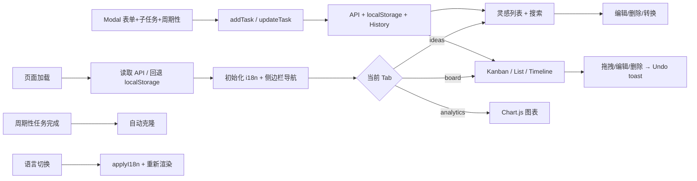

## 总体
- 单页应用（index.html），左侧深色固定侧边栏导航（灵感/看板/分析 Tab），右侧内容区。
- 数据存储：SQLite 数据库（`data/board.db`，通过 sql.js）+ 浏览器 localStorage 离线回退。
- 所有新增/编辑在弹窗（modal）内完成，支持编辑/删除/子任务/周期性任务。
- PWA 支持：Service Worker 离线缓存 + Web App Manifest，可安装到主屏幕。
- 深色/浅色主题切换，跟随系统偏好 + localStorage 持久化（侧边栏始终深色）。
- i18n 中英文切换：t() 函数 + data-i18n 属性，语言存储在 localStorage。

## 数据模型（Task/Idea）
```json
{
  "id": "string (uuid)",
  "title": "string (max 200)",
  "desc": "string (max 2000)",
  "tags": ["string (max 50 each, max 20 items)"],
  "priority": "P1|P2|P3",
  "type": "idea|feature|bug",
  "status": "backlog|todo|dev|done|publish",
  "dependency": "string (max 200，可为空)",
  "releaseTime": "string (可为空，发布时间/里程碑)",
  "risk": false,
  "marker": "''|'inprogress'|'blocked'",
  "subtasks": [{"id": "uuid", "text": "string", "done": false}],
  "recurrence": {"freq": "daily|weekly|monthly"} | null,
  "createdAt": "ISO string",
  "updatedAt": "ISO string",
  "lastMoved": "YYYY-MM-DD"
}
```

## 导航与布局
- 左侧侧边栏（固定 200px，深色背景 #1e293b）：Logo + 纵向 Tab 按钮（灵感/看板/分析），active 状态左侧紫色指示条。
- 顶部 navbar：仅包含工具按钮（主题切换/语言切换/历史/设置下拉/新建任务），不含 Tab。
- 内容区：margin-left 200px，显示当前 Tab 对应的 summary 指标 + 页面内容。
- 默认 Tab：灵感（ideas），Tab 顺序：灵感 → 看板 → 分析。
- 响应式：≤768px 时侧边栏变为底部 Tab 栏，仅显示图标。

## Tab：看板（Board）
- Hero/指标：进行中(todo+dev)、已完成(done)、灵感池(backlog)、已发布(publish)。
- Dashboard Summary：今日推进、阻塞/风险、活跃任务。
- 视图切换：Kanban / List / Timeline 三种视图。
- Kanban：四列 待办(Todo)/进行中(In Progress)/开发完成(Dev Done)/已发布(Published)；卡片可拖拽跨列；空列显示引导提示。
- List View：表格形式展示所有非 backlog 任务。
- Timeline View：按 releaseTime 在时间轴上排列任务。
- 卡片展示：标题(点击展开详情面板)、优先级、类型、描述、标签、子任务进度条、周期性标记。
- 弹窗（与灵感共用）：标题、描述、标签、优先级、类型、状态、依赖、Release、周期性、子任务 checklist。

## Tab：灵感（Ideas）
- Hero/指标：灵感总数(backlog)、进入开发(dev)。
- Backlog 列表：防抖搜索框(300ms)，仅显示 backlog；空状态引导提示。
- 卡片有"转为 Todo"按钮；弹窗支持语音输入（Web Speech API, zh-CN）。

## Tab：分析（Analytics）
- 指标卡片：总任务数、平均周期(天)、本周完成数。
- 四张图表（Chart.js）：
  - 状态分布（甜甜圈图）
  - 优先级分布（柱状图）
  - 每周速率（折线图）
  - 燃尽图（累积创建 vs 完成）

## 交互细节
- Modal：新建/编辑弹窗，子任务可增删改，周期性可选(none/daily/weekly/monthly)。
- 拖拽：仅任务页 Kanban 视图；拖拽跨列触发 Undo toast。
- 转换：灵感 ↔ 任务双向转换。
- 标记：任务卡片标记循环（空 → 进行中 → 阻塞 → 空），持久化到数据库。
- 搜索：ideas 页 300ms 防抖实时过滤。
- Undo：删除和状态变更后显示 5 秒 Undo toast，支持 Ctrl+Z。
- 卡片详情：点击标题打开右侧详情面板，显示完整信息+子任务列表。
- 周期性任务：任务移到 done/publish 时自动克隆为新的 todo 任务。
- Toast 通知：API 错误(红)、警告(黄)、成功(绿)、信息(蓝)、Undo(紫)。

## 键盘快捷键
| 按键 | 功能 |
|------|------|
| `1` | 切换到灵感 Tab |
| `2` | 切换到看板 Tab |
| `3` | 切换到分析 Tab |
| `N` | 新建任务/想法 |
| `/` | 聚焦搜索框 |
| `Esc` | 关闭弹窗/面板 |
| `?` | 显示快捷键帮助 |
| `Ctrl+Z` | 撤销上一个操作 |

## 数据导出/导入
- 设置菜单下拉：导出 JSON、导出 CSV、导入 JSON。
- 导出包含所有任务完整数据。
- 导入支持批量导入（跳过重复 ID 和校验失败的）。

## 前后端数据校验
- 枚举校验：priority(P1/P2/P3)、type(idea/feature/bug)、status(5种)。
- 长度限制：title(200)、desc(2000)、tag(50x20)、dependency(200)、subtasks(50)。
- 前端：红框高亮 + 行内错误消息 + toast 提示。
- 后端：400 错误 + JSON 错误信息。

## API 端点
| 方法 | 路径 | 说明 |
|------|------|------|
| GET | /api/tasks | 获取所有任务 |
| GET | /api/tasks/:id | 获取单个任务 |
| POST | /api/tasks | 创建任务 |
| PUT | /api/tasks/:id | 更新任务 |
| DELETE | /api/tasks/:id | 删除任务 |
| GET | /api/tasks/:id/history | 获取任务变更历史 |
| POST | /api/tasks/:id/clone | 克隆任务(周期性) |
| GET | /api/history | 全局活动历史 |
| GET | /api/analytics | 分析数据(分布/速率/周期/燃尽) |
| GET | /api/export | 导出所有任务 JSON |
| POST | /api/import | 批量导入任务 |

## 技术栈
- 后端：Node.js + Express + sql.js (SQLite)
- 前端：纯 HTML/CSS/JS + FontAwesome CDN + Chart.js CDN
- 数据库：SQLite（`data/board.db`），tables: tasks + task_history
- PWA：Service Worker + Web App Manifest

## 文件结构
```
server.js            — Express 后端（~565行）
public/
  index.html         — 单页应用：侧边栏 + 灵感/看板/分析 Tab（~337行）
  app.js             — 前端逻辑 + i18n 系统（~1620行）
  style.css          — 所有样式含侧边栏（~329行）
  manifest.json      — PWA Manifest
  sw.js              — Service Worker
data/
  board.db           — SQLite 数据库
```

## 简要流程/框架图

